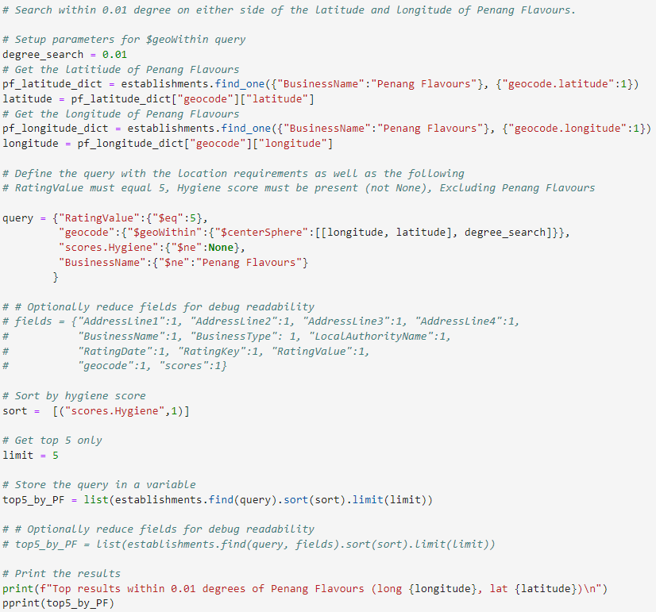

# Evaluate Food Ratings via NOSQL
For this project, I am evaluating food hygiene ratings to help journalists and food critics decide where to focus future articles. This data is provided by the UK Food Standards Agency

# Features
* Import the data provided (establishments.json) and create a Mongo database
* Use jupyter notebook to confirm the database is loaded properly (it exists with the proper collects and documents)
* Make the following updates prior to completing analysis
  * Add the new halal restaurant, "Penang Flavours", that just opened in Greenwich with the BusinessTypeID for "Restaurant/Cafe/Canteen"
  * Remove all establishments in Dover Local Authority
  * Convert latitude and longitude to decimal numbers
  * Conver RatingValue to integer numbers
* Complete the following analysis
  * Determine which establishments have a hygiene score equal to 20
  * Determine which establishments in London have a RatingValue greater than or equal to 4
  * Determine the top 5 establishments with a RatingValue of 5, sorted by lowest hygiene score, nearest to the new restaurant added, "Penang Flavours"
  * Deter,ome how many establishments in each Local Authority area have a hygiene score of 0? Sort the results from highest to lowest.

# Example Query

# File Notes
* Resources folder contains the data that must be loaded prior to executing any of provided code
  * establishments.json contains the data provided in BCS for this challenge. Use the following command in terminal to import the data:  
    mongoimport --type json -d uk_food -c establishments --drop --jsonArray establishments.json
* NoSQL_setup.ipynb was based off NoSQL_setup_starter.ipynb to complete the database setup and modifications prior to analysis
* NoSQL_analysis.ipynb was based off NoSQL_analysis_starter.ipynb to complete the analysis
* Starter_Code folder contains the files provided in BCS/Canvas for completing the challenge

# References
* UK Food Standards Agency (https://www.food.gov.uk/) (2022). UK food hygiene rating data API (https://ratings.food.gov.uk/open-data/en-GB) contains public sector information licensed under the Open Government Licence v3.0 (https://www.nationalarchives.gov.uk/doc/open-government-licence/version/3/). Accessed Sept 9, 2022 and Sept 12, 2022 with the establishment settings as follows: longitude=51.5072, latitude=-0.1276, maxdistancelimit=4567, pagesize=10000, sortoptionkey=distance, pagenumber=(1,2,3,4,5,6,7,8).
* The following links were used as references to implement a query using $geoWithin
    * https://stackoverflow.com/questions/25734092/query-locations-within-a-radius-in-mongodb
    * https://www.mongodb.com/docs/manual/reference/operator/query/geoWithin/#mongodb-query-op.-geoWithin
    * https://www.mongodb.com/docs/manual/reference/operator/query/centerSphere/#mongodb-query-op.-centerSphere

# Getting Started

## Prerequisites
You must have python, jupyter notebok, pandas to run the jupyter notebook.

NoSQL_setup.ipynb must be executed after setting up the database as noted at the start of the notebook. 
NoSQL_analysis.ipynb must executed after executing NoSQL_setup.ipynb.

## Cloning Repo
$ git clone https://github.com/vt-bekah/nosql-challenge.git

$ cd nosql-challenge

$ jupyter lab

# Built With
* Python v3.10.11
* jupyter notebook v6.5.2
* jupyterlab v3.6.3
* conda v23.5.0

**Python Modules**
* pandas v1.5.3
* pymongo v3.12.0
* pprint 

